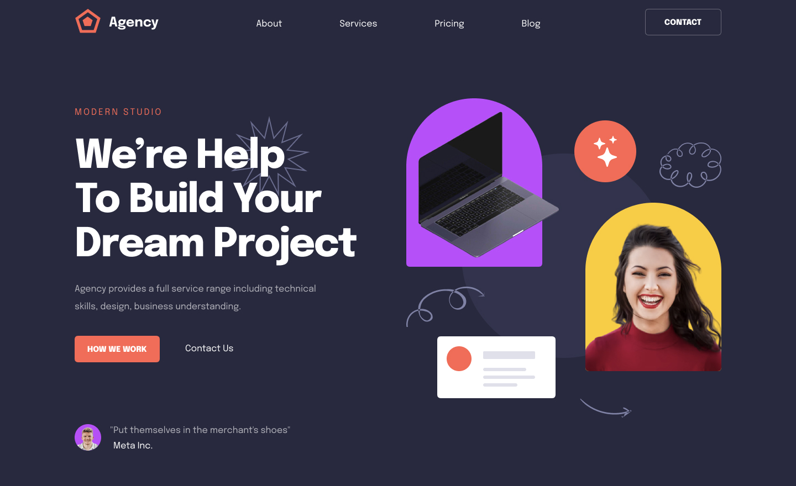

# [IM Agency](https://im-agency.vercel.app/)

This is an open source agency website build with everything new in Next.js 13. It is bootstrapped with `create-next-app`.

[](https://im-agency.vercel.app/)

> **Warning**
> This project is still in development and is not ready for production use.

## Tech Stack

- **Framework:** [Next.js](https://nextjs.org)
- **Styling:** [Tailwind CSS](https://tailwindcss.com)
- **User Management:** [Clerk](https://clerk.com)
- **ORM:** [Prisma](https://www.prisma.io/)

## Pages to be implemented

- [ ] Home
- [ ] About Us
- [ ] Services
- [ ] Portfolio
- [ ] Single Project
- [ ] Blog
- [ ] Single Post
- [ ] Contact

## Running Locally

1. Clone the repository

```bash
git clone https://github.com/hugodessomme/im-agency.git
```

2. Install dependencies using npm

```bash
npm install
```

3. Copy the `.env.example` to `.env` and update the variables.

```bash
cp .env.example .env
```

4. Start the development server

```bash
npm run dev
```

## Contributing

Contributions are welcome! Please open an issue if you have any questions or suggestions. Your contributions will be acknowledged. See the [contributing guide](./CONTRIBUTING.md) for more information.

## License

Licensed under the MIT License. Check the [LICENSE](./LICENSE) file for details.
